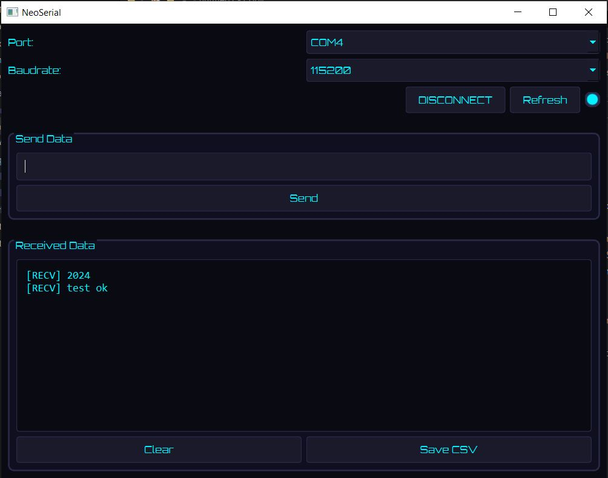

# NeoSerial - Modern Serial Communication Tool

A futuristic GUI application for serial communication with STM32,ESP32,Arduino and other embedded devices, featuring a cyberpunk-inspired design and real-time data streaming.

 

## Features

- 🚀 Modern cyberpunk-themed UI
- 🔄 Automatic port detection with refresh
- ⚡ Real-time bidirectional communication
- 📡 Multiple baud rate support (9600-115200)
- 💾 Persistent connection settings
- 🔔 Visual connection status indicator
- ⌨️ Keyboard shortcuts support
- 📁 Cross-platform compatibility

## Installation
Lunch the Run.bat file
## Prerequisites
- Python 3.8+
- PySide6
- Pyserial

## Basic operations

- 🔄 Click Refresh to scan available ports
- 🔌 Select port and baud rate, then click Connect
- 📤 Type message and click Send or press Enter
- 🧹 Click Clear to reset received messages
- 🔌 Click Disconnect when finished
